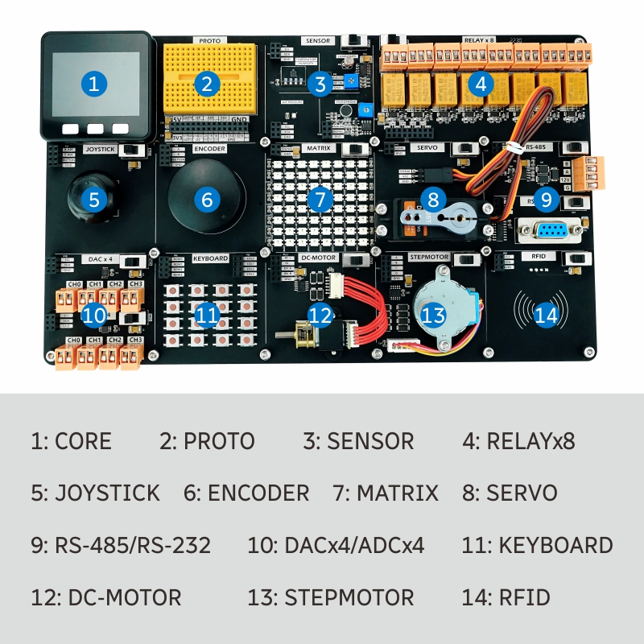

# M5Stack Demo Board UIFlow Code And Examples
This repository contains UIFlow components and examples for the M5Stack Demo Board. There is a lot of information on how to use this board with Arduino IDE and how to programm in C. But there is not a lot information on how to use the Board with UIFlow which is better suited for beginners.

The [Manual](https://m5stack.oss-cn-shenzhen.aliyuncs.com/resource/docs/Demo-Board_en_sht30.pdf) has tons of information on how to use the provided hardware. See the [official documentation](http://docs.m5stack.com/en/app/demo-board_sht30) for even more info.

## 3. Sensor

### Temperature / Humidity Sensor

The SHT30 temperature and humidity sensor located in the sensor
module group can collect temperature and humidity data in the
environment, and transmit data through the I2C protocol. The I2C
address is (0x44)

#### Hardware Connection

Sensor devices that use I2C protocol for communication can be
connected to M5Core's default I2C protocol pins PIN21 (SDA), PIN22 (SCL)

|Link|Description|
|---|---|
|[UIFlow Example](examples/sensor/SHT30%20Temperature%20and%20humidity%20detection/)| Example implementation in UIFlow|
|[Manual](https://docs.m5stack.com/en/app/demo-board_sht30)| The sensor manual|
